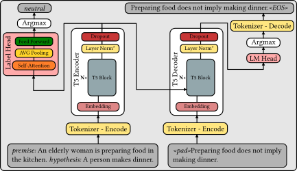
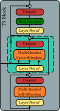

# Evaluating Explanations in Natural Language Inference
Fine-tuning and evaluation of a language model for explanation generation of natural language inference. Fine-tuning scripts for a pre-trained T5 model supporting both full model fine-tuning as well as [Low-Rank Adaptation](https://arxiv.org/abs/2106.09685) (LoRA) fine-tuning using [🤗 PEFT](https://github.com/huggingface/peft) are included in this repository. Furthermore, a testing script for evaluating and generating predictions is included. A probing classifier may additionally be trained and evaluated for getting insights into the correspondence of the inference label with the generated explanations.

## Overview
### Data
The dataset that is used for fine-tuning and evaluating the models is the [e-SNLI](https://huggingface.co/datasets/esnli) dataset. This dataset extends the Standford Natural Language Inference dataset by including explanations for the entailment relations.

The following features are present for each data point:
- Premise: a string feature.
- Hypothesis: a string feature.
- Label: a classification label, with possible values including: 
  - *entailment* (0),
  - *neutral* (1),
  - *contradiction* (2).
- Explanation_1: a string feature.
- Explanation_2: a string feature.
- Explanation_3: a string feature.

The code for the data and pre-processing is encapsulated in [ESNLIDataModule](esnli_data.py), which is a [LightningDataModule](https://lightning.ai/docs/pytorch/stable/data/datamodule.html?highlight%3Ddatamodule) of the PyTorch Lightning framework.

### Model
The model that is trained for the task of explanation generation for natural language inference (NLI) is the [T5 model](https://huggingface.co/docs/transformers/model_doc/t5). The T5 model is an encoder-decoder model. The Flan-T5-Base model has been extensively used for the project. However, any pre-trained T5 model is supported by the project code. A diagram of the complete architecture is shown below.




The main model with the Language Modelling head (LM Head) is wrapped in the [LitT5](source/t5_lit_module.py) class. The model with the probing classifier for the inference label includes the T5 Encoder and Label Head and is wrapped in [LitT5Classify](source/t5_lit_classify.py).  
Both models are a [LightningModule](https://lightning.ai/docs/pytorch/stable/common/lightning_module.html) from the PyTorch Lightning framework.

## Running the code
### Installation
To install all dependencies, run the following command:
```bash
pip install -r requirements.txt
```

### Setup MLOps (Weight & Biases)
For tracking of training and testing experiments, [Weights and Biases](https://wandb.ai/site) (WandB) is used. To log in for the first time, run the following command, and provide your authorization key:
```bash
wandb login
```
Note that the experiments may be run in Anonymous mode (without being logged in).

### Pre-processing data
The code for training, evaluation, and the model performs data preprocessing, so there is no need to preprocess the data separately.

There are certain parameters that may be set from the command line when training or testing the model. These parameters are described in the following.

### Shared options
The following options are shared among the training, evaluation and prediction scripts:

- **--model_name** (*str*) (default: 'google/flan-t5-small'): The name or path of the pre-trained model to use. The models are downloaded via the [Hugging Face Hub](https://huggingface.co/models).
- **--data_path** (*str*) (default: '~/datasets/esnli'): The path to the pre-processed ESNLI dataset. If the dataset is not at the specified location, the dataset will be pre-processed and saved to the specified path.
- **--run_name** (*str*) (default: 'Fine-Tuning'): The name of the run. This will be used to identify the training run in WandB and in the saved checkpoints and results.
- **--checkpoint_load_path** (*str*) (default: None): The path to the directory where a checkpoint will be loaded from. If specified, the model will be initialized from this checkpoint before training.
- **--eval_batch_size** (*int*) (default: 8): The batch size to use for non-training purposes. This is the number of examples that will be used to evaluate the model at each step of validation. This is also the batch_size that will be used to test and generate predictions.
- **--classify** (*bool*) (default: False): Whether to use the model with the probing classifier for the inference label. If set to True, the model will be training/evaluating/predicting with the probing classifier for the inference label.


### Training the model
To train the model on the training set, run the following command:

```bash
python source/train_t5.py [options]
```
The following training specific options are available:
- **--checkpoint_save_path** (*str*) (default: '~/models/'): The path to the directory where checkpoints will be saved during training. The checkpoint files will be saved in this directory as '{run_name}-{time}-{epoch:02d}-{val/loss:.2f}.ckpt'.
- **--fine_tune_mode** (*str*) (default: 'full'): The mode to use for fine-tuning. Can be either "full", "lora". "full" fine-tunes all layers of the model, "lora" fine-tunes only the LoRA layer.
- **--learning_rate** (*float*) (default: 1e-4): The learning rate to use for training. This is the rate at which the model parameters will be updated during training.
- **--train_batch_size** (*int*) (default: 8): The batch size to use for training. This is the number of examples that will be used to update the model parameters at each step of training.
- **--max_epochs** (*int*) (default: 3): The maximum number of epochs to train for. An epoch is a full pass through the entire training dataset.
- **--log_every_n_steps** (*int*) (default: 50): The number of training steps till logging training progress. This reports the average training loss over the last n steps.
- **--val_check_interval** (*int*) (default: 1000): The number of training steps between each validation run. This is the number of steps at which the model will be evaluated on the validation dataset to monitor its performance.
- **--limit_val_batches** (*int*) (default: None): The number of batches to use for validation. If specified, only this many batches will be used for validation. Useful for getting a rough estimate of model performance during training.
- **--n_text_samples** (*int*) (default: 10): The number of explanations to generate for each logging interval specified in *--log_every_n_generated*. During training, the model will generate this many explanations and log them in WandB for inspection of generation during training. If this exceeds the number specified in *--eval_batch_size*, the model will generate this number of explanations.
- **--log_every_n_generated** (*int*) (default: 50): The number of training steps between each logging of generated explanations.

When *--fine_tune_mode* 'lora' is specified, the following additional options are available:
- **--lora_r** (*int*) (default: 8): The LoRA R value
- **--lora_alpha** (*int*) (default: 32): The LoRA alpha value
- **--lora_dropout** (*float*) (default: 0.1): The LoRA dropout value

### Evaluating the model
To evaluate the model on the test set, run the following command:

```bash
python source/evaluate_t5.py [options]
```
The following evaluation specific options are available:
- **--limit_test_batches** (*int*) (default: None): The number of batches to use for testing. If specified, only this many batches will be used for testing. Useful for quick testing.

The code will write the results to the WandB dashboard.

### Predicting outputs of the model (Generating)
To predict the outputs of the model given the test set, run the following command:

```bash
python source/predict_t5.py [options]
```
The following prediction specific options are available:
- **--results_save_path** (*str*) (default: 'results/'): The path to the directory where the prediction results will be saved. The results will be saved in this directory as '{run_name}_{time}.csv'.
- **--limit_predict_batches** (*int*) (default: None): The number of batches to use for prediction. If specified, only this many batches will be used for prediction. Useful for quick testing.

The code will write the results to a csv file to the specified path.

### Evaluation of generated explanations with Inseq
A notebook for inspecting the generated explanations with inference labels using Inseq is found at [inseq_evaluation.ipynb](source/inseq_evaluation.ipynb). More analysis for the classification task with relation to negation can be found at [numeric_evaluation.ipynb](https://github.com/Rmko4/NLP-Explanations-for-NLI/blob/main/source/numeric_evaluation.ipynb).
